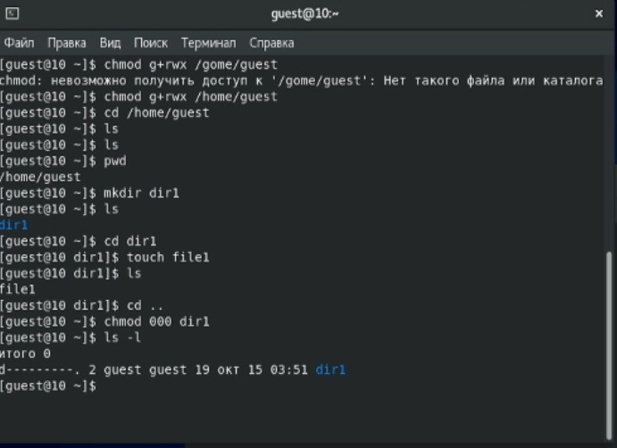

---
## Front matter
title: Лабораторная работа № 3. Дискреционное разграничение прав в Linux. Два пользователя
author: [Радикорский Павел Михайлович, НФИбд-03-18]
institute: "RUDN University, Moscow, Russian Federation"
date: 15.10.2021
lang: "ru"
## Formatting
toc: false
slide_level: 2
theme: metropolis
mainfont: PT Serif
romanfont: PT Serif
sansfont: PT Sans
monofont: Consolas
header-includes:
 - \metroset{progressbar=frametitle,sectionpage=progressbar,numbering=fraction}
 - '\makeatletter'
 - '\beamer@ignorenonframefalse'
 - '\makeatother'
aspectratio: 43
section-titles: true

---
# Цели и задачи

## Цель

Получение практических навыков работы в консоли с атрибутами файлов для групп пользователей

## Задачи

Лабораторная работа подразумевает создание гостевых пользователей, изменение и анализ прав на папки и файлы.

# Выполнение

## Процесс выполнения

Создаём учётную запись пользователя guest, задаём пароль, аналогично создаём guest2
    
{ #fig:001 width=70% }

## Процесс выполнения

Добавляем пользователя guest2 в группу guest, заходим на двух консолях на обе учётные записи, проверяем группы пользователей. Guest входит в группу guest, guest2 входит в группы guest и guest2
    
{ #fig:001 width=70% }

## Процесс выполнения

Сравниваем полученные данные с выводом команд id -Gn и id -G, получаем соответствие

{ #fig:001 width=70% }

## Процесс выполнения

Проверяем файл /etc/group, сравниваем информацию и так же получаем соответствие 

{ #fig:001 width=70% }

## Процесс выполнения

Создаём директорию dir1 в домашнем каталоге пользователя guest с файлом file1 внутри, снимаем с директории все атрибуты

{ #fig:001 width=70% }

## Процесс выполнения

Меняя атрибуты у директории dir1 и файла file1 от имени пользователя guest и делая проверку от пользователя guest2, заполняем таблицу установленных прав и разрешённых действий группы

{ #fig:001 width=70% }

## Процесс выполнения

{ #fig:001 width=70% }

## Процесс выполнения

{ #fig:001 width=70% }

## Процесс выполнения

На основании заполненной таблицы определяем те или иные минимально необходимые права для выполнения пользователем guest2 операций внутри директории dir1, заполняем таблицу минимальных прав для совершения операций от имени пользователей входящих в группу

{ #fig:001 width=70% }

# Выводы

На основании выполненной лабораторной работы были получены практические навыки работы в консоли по изменению атрибутов файлов и папок в группах