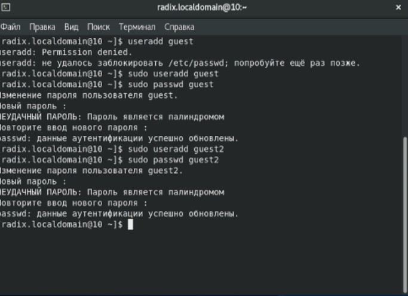
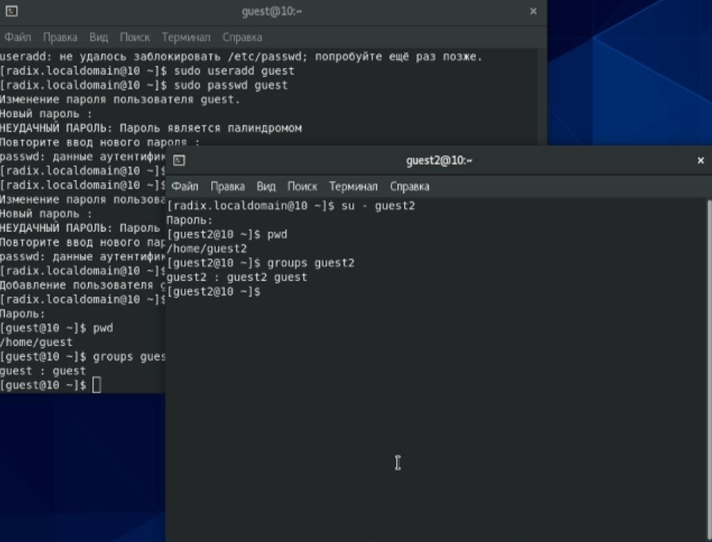
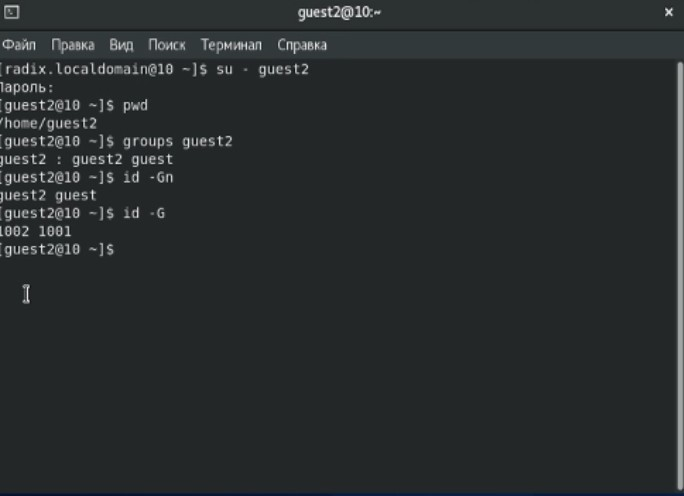
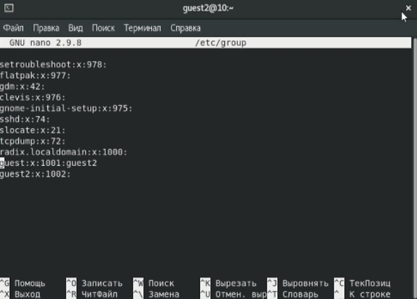
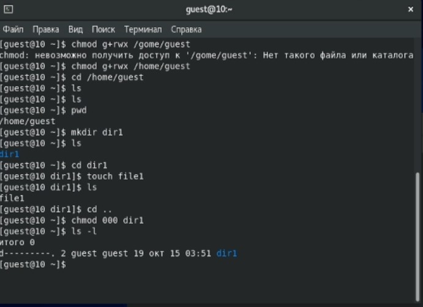
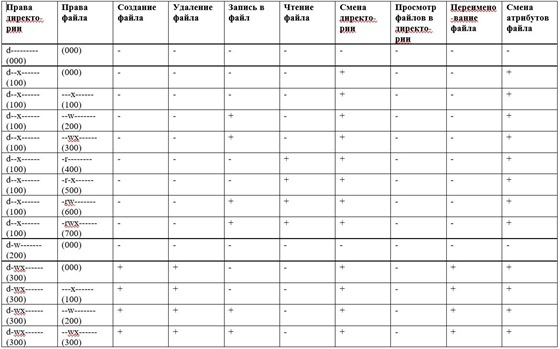
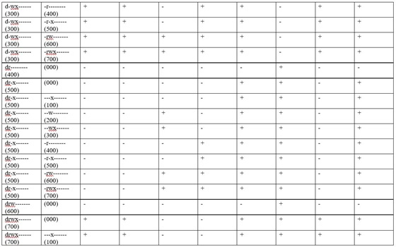

---
title: "Лабораторная работа № 3. Дискреционное разграничение прав в Linux. Два пользователя"
author: [Радикорский Павел Михайлович, НФИбд-03-18]
institute: "RUDN University, Moscow, Russian Federation"
date: "15.10.2021"
keywords: [Безопасность, Лабораторная]
lang: "ru"
toc-title: "Содержание"
toc: true # Table of contents
toc_depth: 2
lof: true # List of figures
fontsize: 12pt
mainfont: PT Serif
romanfont: PT Serif
sansfont: PT Sans
monofont: Consolas
mainfontoptions: Ligatures=TeX
romanfontoptions: Ligatures=TeX
sansfontoptions: Ligatures=TeX,Scale=MatchLowercase
monofontoptions: Scale=MatchLowercase
titlepage: true
titlepage-text-color: "000000"
titlepage-rule-color: "000000"
titlepage-rule-height: 0
listings-no-page-break: true
indent: true
header-includes:
  - \usepackage{sectsty}
  - \sectionfont{\clearpage}
  - \linepenalty=10 # the penalty added to the badness of each line within a paragraph (no associated penalty node) Increasing the value makes tex try to have fewer lines in the paragraph.
  - \interlinepenalty=0 # value of the penalty (node) added after each line of a paragraph.
  - \hyphenpenalty=50 # the penalty for line breaking at an automatically inserted hyphen
  - \exhyphenpenalty=50 # the penalty for line breaking at an explicit hyphen
  - \binoppenalty=700 # the penalty for breaking a line at a binary operator
  - \relpenalty=500 # the penalty for breaking a line at a relation
  - \clubpenalty=150 # extra penalty for breaking after first line of a paragraph
  - \widowpenalty=150 # extra penalty for breaking before last line of a paragraph
  - \displaywidowpenalty=50 # extra penalty for breaking before last line before a display math
  - \brokenpenalty=100 # extra penalty for page breaking after a hyphenated line
  - \predisplaypenalty=10000 # penalty for breaking before a display
  - \postdisplaypenalty=0 # penalty for breaking after a display
  - \floatingpenalty = 20000 # penalty for splitting an insertion (can only be split footnote in standard LaTeX)
  - \raggedbottom # or \flushbottom
  - \usepackage{float} # keep figures where there are in the text
  - \floatplacement{figure}{H} # keep figures where there are in the text
...

# Цели и задачи

**Цель:** Получение практических навыков работы в консоли с атрибутами файлов для групп пользователей

**Задачи:**

Лабораторная работа подразумевает создание гостевых пользователей, изменение и анализ прав на папки и файлы.

# Теоретическая справка

В Unix каждому файлу соответствует набор прав доступа, представленный в виде 9-ти битов режима. Он определяет, какие пользователи имеют право читать файл, записывать в него данные или выполнять его. Вместе с другими тремя битами, влияющими на запуск исполняемых файлов, этот набор образует код режима доступа к файлу. Двенадцать битов режима хранятся в 16-битовом поле индексного дескриптора вместе с 4-мя дополнительными битами, определяющими тип файла. Последние 4 бита устанавливаются при создании файлов и не подлежат изменению. Биты режима (далее права) могут изменяться либо владельцем файла, либо суперпользователем с помощью команды chmod.

# Выполнение

Создаём учётную запись пользователя guest, задаём пароль, аналогично создаём guest2
    
{ #fig:001 width=70% }

Добавляем пользователя guest2 в группу guest, заходим на двух консолях на обе учётные записи, проверяем группы пользователей. Guest входит в группу guest, guest2 входит в группы guest и guest2
    
{ #fig:001 width=70% }

Сравниваем полученные данные с выводом команд id -Gn и id -G, получаем соответствие

{ #fig:001 width=70% }

Проверяем файл /etc/group, сравниваем информацию и так же получаем соответствие 

{ #fig:001 width=70% }

Создаём директорию dir1 в домашнем каталоге пользователя guest с файлом file1 внутри, снимаем с директории все атрибуты

{ #fig:001 width=70% }

Меняя атрибуты у директории dir1 и файла file1 от имени пользователя guest и делая проверку от пользователя guest2, заполняем таблицу установленных прав и разрешённых действий группы

{ #fig:001 width=70% }

На основании заполненной таблицы определяем те или иные минимально необходимые права для выполнения пользователем guest2 операций внутри директории dir1, заполняем таблицу минимальных прав для совершения операций от имени пользователей входящих в группу

{ #fig:001 width=70% }

#  Выводы

На основании выполненной лабораторной работы были получены практические навыки работы в консоли по изменению атрибутов файлов и папок в группах